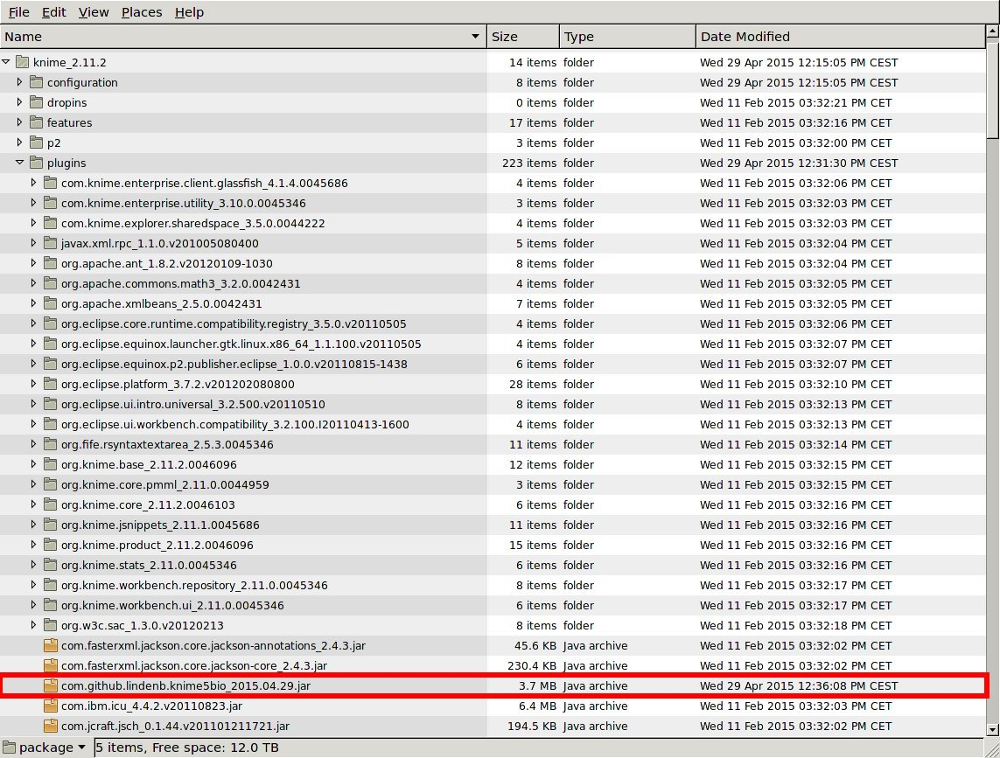

# KNIME5Bio

## Pourquoi de nouvelles extensions ?

Pourquoi ne pas rester avec les extensions de knime4bio ?


* avec les nouvelles versions de knime, des noeuds sont maintenant inutiles
* des noeuds ne sont pas/plus utilisés
* problème pour developper simultanement des outils en ligne de commande et des outils graphiques.
* nouvelle specifications pour VCF: alleles symbolique, allele de deletion, etc... : utiliser les librairies informatiques telles que **htsjdk** ( https://github.com/samtools/htsjdk/) permettent de coller à la specification
* les noeuds de knime4bio ne permettent pas de garder l'en tête du VCF: on perd la sémantique des VCFs . Par exemple, quelles sont les colonnes des annotations VEP ? 
```
G|intron_variant|MODIFIER||2475|Transcript|XM_005263441.1|protein_coding||27/27|||-/4409|-/4215|-/1404||||1||-1|||||XP_005263498.1||||,
```
* l'utilisation de la librairie **htsjdk** pour les VCF permet de simplifier la filtration des VCF.

## Installation

* java 8 est requis
* telecharger et installer une version récente de Download KNIME Analytics Platform  : https://www.knime.org/downloads/overview . La version que j'ai utilisé est **3.1**.
* n'ouvrez pas l'application knime pour le moment
* localisez le repertoire 'plugins' de knime



* supprimer un ancien fichier `com.github.lindenb.knime5bio*.jar` si il est présent dans le répertoire `plugins`.
* télécharger et installer le nouveau fichier  `com.github.lindenb.knime5bio*.jar` dans le répertoire `plugins`.
* dans le repertoire du dessus (knime) ouvrez le fichier `knime.ini` avec un éditeur de texte (notepad...) et forcer knime à parler anglais... 

Sur la première ligne inserez:

```
-clean
```


Et **après** la ligne:

```
-Dsun.java2d.d3d=false
```

Ajouter les lignes suivantes:

```
-Duser.language=en
-Duser.country=US
```


* lancer l'application knime

## Les nouveaux noeuds

Des noeuds manipulent du **VCF** sous la forme de **table de données** ces noeuds on généralement besoin de deux slots(entrée) : une pour l'en-tête du VCF et l'autre pour le corps du VCF (variants....).

Certains noeuds vont créér de nouveau fichiers (par exemple les noeuds utilisant GATK). Ces noeuds ne vont donc pas lire ou écrire des **tables** de **données** mais des **tables** contenant des chemin d'accès vers des fichiers.

Il est nécessaire de définir un répertoire de travail sur votre machine où seront stockés ces fichiers). Les fichiers dans ce répertoire sont susceptibles d'être effacés quand vous 'reset'-ez un noeud.

Pour définir ce répertoire de travail, faire un click-droit sur le projet & ajouter la variable `com.github.lindenb.knime5bio.working.directory` (type=STRING)


Une fois knime lancé, les nouveaux noeuds devraient apparaitre sous `community nodes`


### JVarkit

les outils **jvarki**t appellent quelques-un des programmes en ligne de commande que j'ai écrit dans https://github.com/lindenb/jvarkit.

#### vcffilterjs

C'est le noeud le plus puissant , il permet de filter chaque ligne de VCF en utilisant une expression **javascript**. A chaque ligne du VCF deux variables sont injectées:

 *  **variant**  un objet de type VariationContext : https://samtools.github.io/htsjdk/javadoc/htsjdk/htsjdk/variant/variantcontext/VariantContext.html
 * **header** l'en tête du VCF.

le script doit renvoyer un booléen (VRAI/FAUX) pour savoir si le variant est accepté 

Il est bien évident que vous n'allez pas apprendre à écrire du javascript, mais il peut s'utiliser relativement intuituvement.

##### Example 1

on souhaite garder les indels. La variable **variant** contient justement la méthod [isIndel()](https://samtools.github.io/htsjdk/javadoc/htsjdk/htsjdk/variant/variantcontext/VariantContext.html#isIndel--) . Le script sera donc:

```
variant.isIndel()
```

##### Example 2

on souhaite virer les indels. le signe '==' est l'operateur d'égalité

```
variant.isIndel() == false
```


##### Example 3

on souhaite garder les indels ou bien les variants ayant un ID. L'operateur `||` sert à exprimer 'ou bien'. On se sert de [hasId()](https://samtools.github.io/htsjdk/javadoc/htsjdk/htsjdk/variant/variantcontext/VariantContext.html#hasID--)

```
variant.isIndel() || variant.hasId()
```


##### Example 4

on souhaite garder les indels ou bien les variants ayant un ID. Les deux doivent avoir un seul allele alternatif.  L'operateur `&&` sert à exprimer 'ET'. On se sert de [getAlternateAlleles()](https://samtools.github.io/htsjdk/javadoc/htsjdk/htsjdk/variant/variantcontext/VariantContext.html#getAlternateAlleles--) pour avoir la liste des alleles alternatifs. Cette liste possède une méthode 'size' permettant d'avoir sa taille.

```
( variant.isIndel() || variant.hasId() ) && variant.getAlternateAlleles().size() == 1
```


##### Example 5

on veut que le génotype de l'échantillon "Chouquette" soit Heterozygote.

* [getGenotype(name)](https://samtools.github.io/htsjdk/javadoc/htsjdk/htsjdk/variant/variantcontext/VariantContext.html#getGenotype-java.lang.String-) permet d'avoir le génotype d'un individus. Il retourne un objet de type [Genotype](https://samtools.github.io/htsjdk/javadoc/htsjdk/htsjdk/variant/variantcontext/Genotype.html)
* Cet objet de type  [Genotype](https://samtools.github.io/htsjdk/javadoc/htsjdk/htsjdk/variant/variantcontext/Genotype.html) a une méthode [isHet()](https://samtools.github.io/htsjdk/javadoc/htsjdk/htsjdk/variant/variantcontext/Genotype.html#isHet--)

```
variant.getGenotype("Chouquette").isHet()
```

##### Example 6

on peut faire bien plus compliqué... le script suivant accepte le variant si plus de deux samples ont une depth > 200.
Pour ce genre de filtration: faire appel à moi pour eviter d'extraire les données avec KNIME avec une suite de noeuds...

```
function myfilterFunction()
    {
    var samples=header.genotypeSamples;
    var countOkDp=0;
    for(var i=0; i< samples.size();++i)
        {
        var sampleName=samples.get(i);
        if(! variant.hasGenotype(sampleName)) continue;
        var genotype = variant.genotypes.get(sampleName);
        if( ! genotype.hasDP()) continue;
        var dp= genotype.getDP();
        if(dp < 200 ) countOkDp++;
        }
    return (countOkDp>2)
    }
myfilterFunction();
```
 
 
#### bioalcidae

Bioalcidae permette de reformatter un fichier VCF en ce que vous voulez, par exemple un fichier bed. Il est similaire à **jvarkit**: C'est un noeud qui prend du javascript et dans lequel on inject un iterateur (**iter**) sur des variants de VCF. Une autre variable **out** est le flux d'écriture. Par l'exemple:

##### exemple 1

Ecrire un fichier contenant les chrom/start/end de toutes les indels:

```
while(iter.hasNext()) {
  var variant = iter.next();
  if( ! variant.isIndel()  ) continue;
  out.println( variant.getContig()+" "+variant.getStart()+"-"+variant.getEnd());
}
```

##### exemple 2
Reformating a VCF we want to reformat a VCF with header

```
CHROM POS REF ALT GENOTYPE_SAMPLE1 GENOTYPE_SAMPLE2 ... GENOTYPE_SAMPLEN
```

we use the following javascript file:

```
var samples = header.sampleNamesInOrder;
out.print("CHROM\tPOS\tREF\tALT");
for(var i=0;i< samples.size();++i)
    {
    out.print("\t"+samples.get(i));
    }
out.println();

while(iter.hasNext())
    {
    var ctx = iter.next();
    if(ctx.alternateAlleles.size()!=1) continue;
    out.print(ctx.chr +"\t"+ctx.start+"\t"+ctx.reference.displayString+"\t"+ctx.alternateAlleles.get(0).displayString);
    for(var i=0;i< samples.size();++i)
        {
        var g = ctx.getGenotype(samples.get(i));

        out.print("\t");

        if(g.isHomRef())
            {
            out.print("0");
            }
        else if(g.isHomVar())
            {
            out.print("2");
            }
        else if(g.isHet())
            {
            out.print("1");
            }
        else
            {
            out.print("-9");
            }
        }
    out.println();
    }
```

#### expandvep

prend un fichier VCF annoté par VEP et ajoute de nouvelles colonnes correspondant au annotations VEP (CSQ=).
La ligne variant est dupliqué autant de fois qu'il y a de conséquences pour un variant.

#### extractinfo

Extrait un champ INFO du VCF.

#### filterso


prend un fichier VCF annoté par VEP ne garde les variant ayant une annotation match-ant un ou plusieur terme de sequence ontology http://www.sequenceontology.org/ .  Le noeud gère l'arborescence: c'est à dire que si on demande les 'SO:0001576 = transcript variants' ( http://www.sequenceontology.org/browser/current_svn/term/SO:0001576 ) il va automatoquement prendre 'intron_variant', 'exon_variant' etc...


#### groupbygene

noeud de groupbygene https://github.com/lindenb/jvarkit/wiki/GroupByGene

#### indexvcf

certains noeuds de GATK on besoin qu'un VCF soir trié, un indexé avec bgzip/tabix. Ce noeud permet d'indexer les VCFs.


#### multitooneallele

noeud de https://github.com/lindenb/jvarkit/wiki/VcfMultiToOneAllele 

> VCF: "one variant with N ALT alleles" to "N variants with one ALT".

#### multitooneinfo

duplique la ligne du variant autant de fois qu'il y a de valeur pour un tag donné dans la colonne INFO.

#### table2vcf

sauve une table VCF (slot header + slot body) dans un fichier


#### vcf2table

transforme un fichier VCF en une table VCF (slot header + slot body) 

#### vcfpeekvcf

noeud de https://github.com/lindenb/jvarkit/wiki/VcfPeekVcf

prend les INFO d'un autre VCF pour les transférer sur le VCF en cours.

### Fasta

#### readfasta

lit un fichier fasta dans une table

#### writefasta

ecrit des séquence FASTA dans un fichier


### GATK

les noeud **GATK** appelent le Genome Analysis Toolkit du Broad. Pour cela il faut donc ( https://www.broadinstitute.org/gatk/guide/tooldocs/org_broadinstitute_gatk_engine_CommandLineGATK.php ):

* le GenomeAnalysisTK.jar de gatk. J'ai bossé sur la version 3.5
* le génome de reference au format fasta ainsi que les index *.dict et *.fai . Me demander.
* tous les noeuds GATK peuvent être optionement limité à un BED.

#### combinevariants:

merge plusieurs VCFs https://www.broadinstitute.org/gatk/guide/tooldocs/org_broadinstitute_gatk_tools_walkers_variantutils_CombineVariants.php

#### leftalign 

> Left-align indels in a variant callset

https://www.broadinstitute.org/gatk/guide/tooldocs/org_broadinstitute_gatk_tools_walkers_variantutils_LeftAlignAndTrimVariants.php


#### Phase By Transmission


> Compute the most likely genotype combination and phasing for trios and parent/child pairs

permet également de déctecter les anomalies mendeliennes.

https://www.broadinstitute.org/gatk/guide/tooldocs/org_broadinstitute_gatk_tools_walkers_phasing_PhaseByTransmission.php

>  This tool performs two functions:
> Compute the most likely genotype combination of trios and parent/child pairs given their genotype likelihoods and a mutation prior
> Phase all sites were parent/child transmission can be inferred unambiguously.
> The tool ultimately reports the genotype combination (and hence phasing) probability.


>  MendelianViolationsFile: An optional argument for reporting. If a file is specified, all sites that remain in mendelian violation after being assigned the most likely genotype combination will be reported there. Information reported: chromosome, position, filter, allele count in VCF, family, transmission probability, and each individual genotype, depth, allelic depth and likelihoods.
> DeNovoPrior: Prior probability of de novo mutations. The default value of 1e-8 is fairly stringent, so if you are interested in maximizing sensitivity at the expense of specificity (i.e. are ok with seeing some false positives as long as all true positives are detected) you will need to relax this value.

#### selectvariants

Select a subset of variants from a larger callset

https://www.broadinstitute.org/gatk/guide/tooldocs/org_broadinstitute_gatk_tools_walkers_variantutils_SelectVariants.php

> Often, a VCF containing many samples and/or variants will need to be subset in order to facilitate certain analyses (e.g. comparing and contrasting cases vs. controls; extracting variant or non-variant loci that meet certain requirements, displaying just a few samples in a browser like IGV, etc.). SelectVariants can be used for this purpose.
> There are many different options for selecting subsets of variants from a larger callset:
> * Extract one or more samples from a callset based on either a complete sample name or a pattern match.
> * Specify criteria for inclusion that place thresholds on annotation values, e.g. "DP > 1000" (depth of coverage greater than 1000x), "AF < 0.25" (sites with allele frequency less than 0.25). These criteria are written as "JEXL expressions", which are documented in the article about using JEXL expressions.
> * Provide concordance or discordance tracks in order to include or exclude variants that are also present in other given callsets.
> * Select variants based on criteria like their type (e.g. INDELs only), evidence of mendelian violation, filtering status, allelicity, and so on.
> There are also several options for recording the original values of certain annotations that are recalculated when a subsetting the new callset, trimming alleles, and so on.

#### variantfiltration

Filter variant calls based on INFO and FORMAT annotations

https://www.broadinstitute.org/gatk/guide/tooldocs/org_broadinstitute_gatk_tools_walkers_filters_VariantFiltration.php

>  This tool is designed for hard-filtering variant calls based on certain criteria. Records are hard-filtered by changing the value in the FILTER field to something other than PASS. Filtered records will be preserved in the output unless their removal is requested in the command line. 

#### variant to table

> Extract specific fields from a VCF file to a tab-delimited table

https://www.broadinstitute.org/gatk/guide/tooldocs/org_broadinstitute_gatk_tools_walkers_variantutils_VariantsToTable.php


>  This tool is designed to extract fields from the VCF to a table format that is more convenient to work with in downstream analyses. 

### Utilitaires

#### file to table

convertit un fichier tab-délimité en Table-knime


## How to Cite
