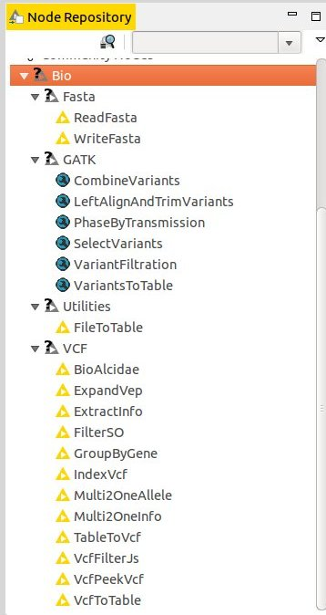

# Installer Knime5bio

* telecharger et installer une version récente de Download KNIME Analytics Platform  : https://www.knime.org/downloads/overview 
* n'ouvrez pas l'application knime pour le moment
* localisez le repertoire 'plugins' de knime


* supprimer un ancien fichier `com.github.lindenb.knime5bio*.jar` si il est présent dans le répertoire `plugins`.
* télécharger et installer le nouveau fichier  `com.github.lindenb.knime5bio*.jar` dans le répertoire `plugins`.
* dans le repertoire du dessus (knime) ouvrez le fichier `knime.ini` avec un éditeur de texte (notepad...) et forcer knime à parler anglais... Pour cela, **après** la ligne:

```
-Dsun.java2d.d3d=false
```

Ajouter les lignes suivantes:

```
-Duser.language=en
-Duser.country=US
```


* lancer l'application knime, les nouveaux noeuds devraient apparaitre sous `community nodes`




## Contribuez

- Reportez les problèmes sur : http://github.com/lindenb/knime5bio/issues
- Source Code: http://github.com/lindenb/knime5bio


